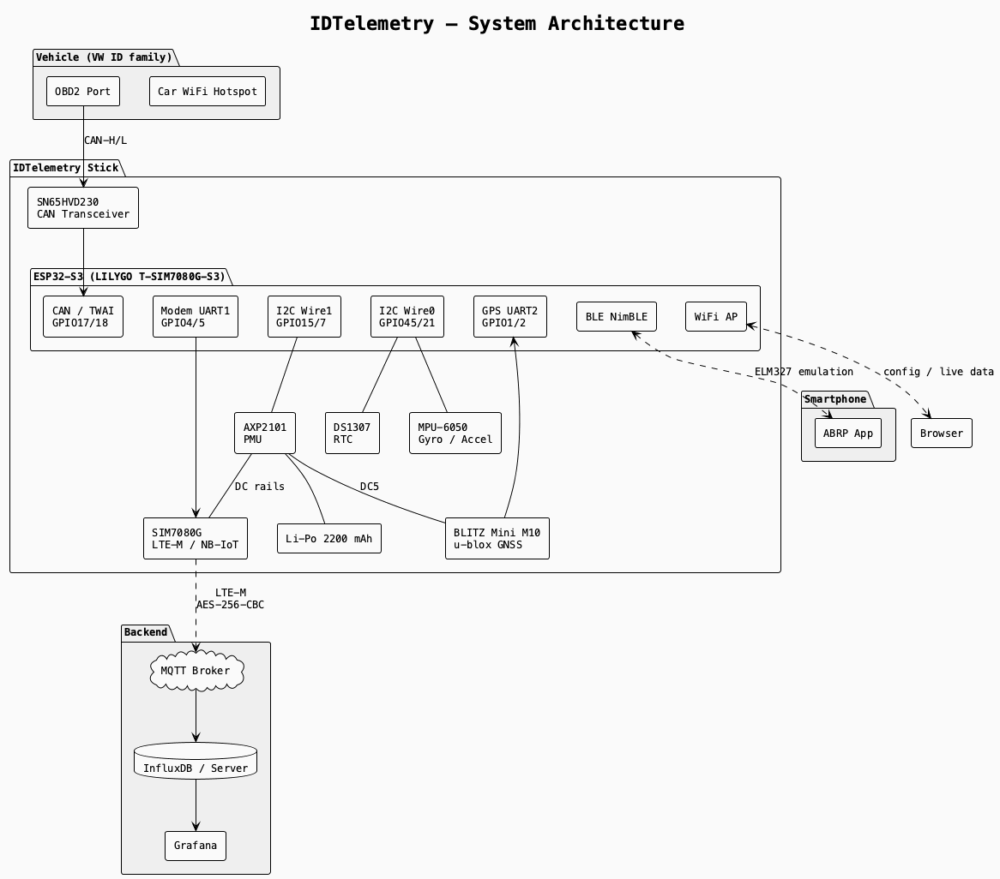
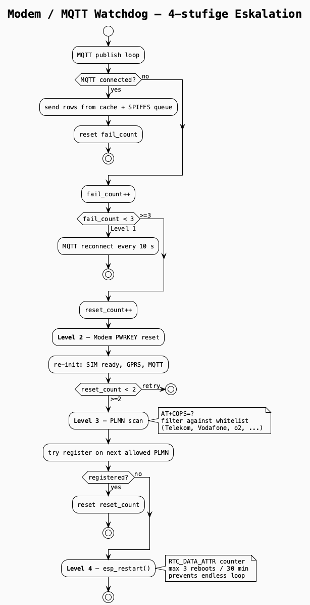
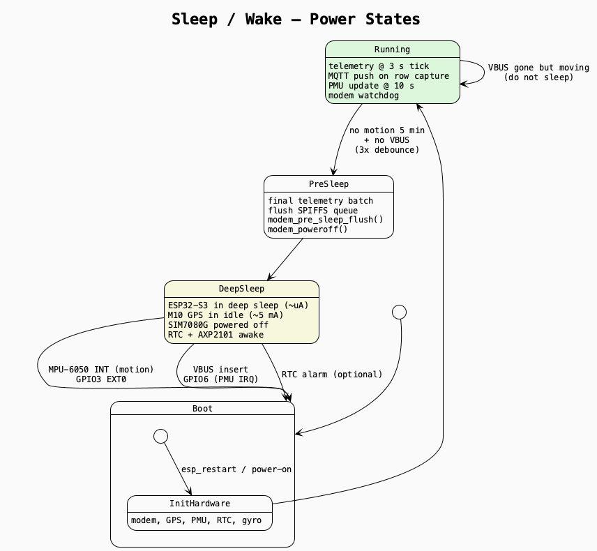

# IDTelemetry

**TeslaMate for the rest of us** — an ESP32-based telemetry stick for the VW ID.7 (and potentially other VW MEB platform vehicles).

Born out of frustration: the VW ID.7 shows you almost nothing about what's happening under the hood. No real SoC, no battery temperature, no power draw, no charge curve — not even a simple energy consumption history. Even a base-model VW Hybrid will give you more data on the dashboard than an ID.7 does. TeslaMate showed the world what vehicle telemetry *could* look like. This project tries to bring that same spirit to the VW ID family — a DIY box that plugs into OBD2 and turns a black-box EV into something you can actually understand.

## What It Does

- Reads battery, drivetrain and climate data from the CAN bus (UDS/ISO-TP)
- Pushes telemetry to **InfluxDB** over LTE-M for Grafana dashboards
- Tracks location via **Traccar** (OsmAnd protocol)
- Emulates a **BLE ELM327** so ABRP sees the car natively
- Runs a **WiFi AP with a full Web-UI** for live data, config and debugging
- Sleeps in the **low-µA range** when parked, wakes on motion

## Architecture



The stick reads CAN data via UDS, pushes encrypted telemetry over LTE-M MQTT, exposes a BLE ELM327 emulation for ABRP, and serves a local Web-UI on its WiFi AP. Sources are in [docs/](docs/) (`*.puml`, render with `plantuml`).

### Modem Watchdog

When MQTT or GPRS misbehave, the firmware escalates through four levels before giving up — built to survive long radio dead zones without endless reboot loops.



### Sleep / Wake



## Hardware

| Component | Details |
| --------- | ------- |
| MCU | LILYGO T-SIM7080G-S3 (ESP32-S3, 16 MB Flash, 8 MB PSRAM) |
| CAN Transceiver | SN65HVD230 (3.3 V, active mode) |
| Modem | SIM7080G (LTE-M / NB-IoT), onboard |
| GPS + Compass | BLITZ Mini M10 (u-blox M10 multi-GNSS + QMC5883L compass) — external via UART |
| GPS (fallback) | SIM7080G integrated GNSS (used when external GPS is disabled) |
| PMU | AXP2101 (onboard, manages DC rails for modem, GPS, peripherals) |
| RTC | DS1307 + CR2032 (keeps time across power cycles) |
| IMU | MPU-6050 (accelerometer + gyroscope, motion wake-up) |

## GPS Modes

The firmware supports two GPS configurations controlled by `GPS_EXT_ENABLED` in `config.h`:

**External GPS (default, recommended):**
The BLITZ Mini M10 runs continuously on UART2 (GPIO1/GPIO2) and maintains a fix independently of the modem. LTE stays connected via MQTT at all times — no GPS/LTE cycling needed. The M10 draws ~5–8 mA in idle and keeps tracking even during sleep transitions. Power is supplied via the PMU DC5 rail (3.3 V).

**Internal GPS (fallback):**
When `GPS_EXT_ENABLED` is set to `false`, the SIM7080G's built-in GNSS is used instead. Because the SIM7080G shares a single radio frontend, GPS and LTE data cannot run simultaneously. The device cycles between modes every 60 seconds:

```text
GPS active (55 s) → GPS off → LTE on → send data → LTE off → GPS on
```

The external GPS eliminates this limitation entirely.

## Web UI

The device opens a WiFi Access Point:

- SSID: `IDTelemetry`
- Password: `IDTelemetry1`
- URL: `http://192.168.4.1`

Three pages: **Data** (live telemetry table), **Debug** (gyro graph, compass, CAN tools, logs) and **Config** (WiFi, SIM/APN, MQTT, OTA firmware update).

## Installation Guide

### Bill of Materials

| Part | Description | approx. Price |
| ---- | ----------- | ------------- |
| LILYGO T-SIM7080G-S3 | ESP32-S3 board with LTE-M/NB-IoT modem | ~35 € |
| SN65HVD230 CAN Transceiver | 3.3 V CAN bus module | ~3 € |
| OBD2 plug with cable | 16-pin OBD2 connector (pin 6 + 14 for CAN) | ~5 € |
| BLITZ Mini M10 | u-blox M10 GNSS + QMC5883L compass (UART) | ~40 € |
| DS1307 RTC module | Real-time clock (I2C) with coin cell | ~2 € |
| MPU-6050 breakout | Accelerometer / gyroscope (I2C) | ~3 € |
| LTE-M SIM card | e.g. ThingsMobile (prepaid, no contract) | ~15 € |
| USB-C cable | For flashing and power | — |

### Step 1 — Install Toolchain

1. Install [VSCode](https://code.visualstudio.com)
2. Install the **PlatformIO IDE** extension in VSCode
3. Clone this repo or download it as a ZIP

### Step 2 — Add Credentials

```bash
cp src/secrets.h.example src/secrets.h
```

Open `src/secrets.h` and fill in:

- **APN** of your mobile carrier (e.g. `TM` for ThingsMobile)
- **Traccar** host + device ID (if you want GPS tracking)
- **InfluxDB** host, org, bucket, token (if you want telemetry dashboards)
- **Guard SSID** of the car's hotspot (e.g. `"My VW 1747"`)

### Step 3 — Wiring

```text
LILYGO T-SIM7080G-S3          External Modules
┌──────────────────┐
│                  │         ┌─── CAN Bus (OBD2) ───┐
│ GPIO17 (CAN TX) ─┼──→ SN65HVD230 CTX ──→ OBD2 Pin 6  (CAN-H)
│ GPIO18 (CAN RX) ─┼──→ SN65HVD230 CRX ──→ OBD2 Pin 14 (CAN-L)
│                  │
│                  │         ┌─── I2C Bus (shared) ──┐
│ GPIO45 (SDA) ────┼──→ DS1307 + MPU-6050 + QMC5883L (SDA)
│ GPIO21 (SCL) ────┼──→ DS1307 + MPU-6050 + QMC5883L (SCL)
│                  │
│ GPIO3  (INT) ────┼──← MPU-6050 INT (deep sleep wake-up)
│                  │
│                  │         ┌─── External GPS ──────┐
│ GPIO1  (RX) ─────┼──← BLITZ M10 TX  (UART2, 115200 baud)
│ GPIO2  (TX) ─────┼──→ BLITZ M10 RX
│                  │
│ 3V3 ─────────────┼──→ VCC for CAN transceiver + RTC
│ GND ─────────────┼──→ GND for all modules
└──────────────────┘

Onboard (no wiring needed):
  GPIO5/4   → SIM7080G UART   (modem, UART1)
  GPIO41    → SIM7080G PWRKEY
  GPIO42    → SIM7080G DTR
  GPIO40    → SIM7080G STATUS
  GPIO44    → SIM7080G FLIGHT (RF kill)
  GPIO15/7  → AXP2101 I2C     (PMU, Wire1)
  GPIO6     → AXP2101 INT     (VBUS wake-up)
```

Insert a nano-SIM card into the slot on the bottom of the LILYGO board.

**Note:** The MPU-6050 AD0 pin must be pulled to 3.3 V so it uses I2C address `0x69` (avoiding collision with the DS1307 at `0x68`). The BLITZ M10 is powered by the PMU DC5 rail (3.3 V).

### Step 4 — Flash Firmware

Connect the board via USB-C, then in VSCode/PlatformIO:

1. **Upload Filesystem Image** — uploads the Web UI to SPIFFS (only needed once, or after HTML changes)
2. **Upload** — flashes the firmware

Or via terminal:

```bash
pio run --target uploadfs   # upload Web UI
pio run --target upload      # flash firmware
```

### Step 5 — Connect

1. Connect to the **IDTelemetry** WiFi (password: `IDTelemetry1`)
2. Open `http://192.168.4.1` in your browser
3. Configure WiFi Guard, thresholds and backend credentials on the Config page

## GPIO Reference

| GPIO | Function | Direction | Bus |
| ---- | -------- | --------- | --- |
| 1 | External GPS RX (← M10 TX) | IN | UART2 |
| 2 | External GPS TX (→ M10 RX) | OUT | UART2 |
| 3 | MPU-6050 INT (deep sleep wake) | IN | EXT1 |
| 4 | Modem RX (← SIM7080G TX) | IN | UART1 |
| 5 | Modem TX (→ SIM7080G RX) | OUT | UART1 |
| 6 | PMU interrupt (VBUS wake) | IN | — |
| 7 | PMU SCL | BIDIR | I2C Wire1 |
| 15 | PMU SDA | BIDIR | I2C Wire1 |
| 17 | CAN TX | OUT | TWAI |
| 18 | CAN RX | IN | TWAI |
| 21 | Sensor SCL | BIDIR | I2C Wire0 |
| 40 | Modem STATUS | IN | — |
| 41 | Modem PWRKEY | OUT | — |
| 42 | Modem DTR | OUT | — |
| 44 | Modem FLIGHT / RF kill | OUT | — |
| 45 | Sensor SDA | BIDIR | I2C Wire0 |

I2C Wire0 devices: DS1307 (`0x68`), MPU-6050 (`0x69`), QMC5883L (`0x0D` — onboard BLITZ M10)

## Safety & Power Management

### WiFi Guard

CAN bus TX is **only enabled while the configured car WiFi SSID is visible**. If the car's hotspot goes out of range, TX is locked immediately. This prevents accidental bus writes when the stick is powered outside the vehicle. An alternative guard mode uses VBUS detection (external 12 V power present = car is on).

### Deep Sleep

When the gyro detects no movement (car parked):

1. Final telemetry batch is sent
2. GPS enters idle mode (M10 keeps tracking at ~5 mA, resumes instantly)
3. ESP32-S3 enters deep sleep (µA range)
4. Wakes on MPU-6050 motion interrupt (GPIO3) or VBUS insertion (GPIO6)

## Open-Source Dependencies

| Library | License | Author |
| ------- | ------- | ------ |
| [arduino-esp32](https://github.com/espressif/arduino-esp32) | Apache 2.0 | Espressif |
| [AsyncTCP](https://github.com/mathieucarbou/AsyncTCP) | LGPL v3 | mathieucarbou |
| [ESPAsyncWebServer](https://github.com/mathieucarbou/ESPAsyncWebServer) | LGPL v3 | mathieucarbou |
| [TinyGSM](https://github.com/vshymanskyy/TinyGSM) | LGPL v3 | vshymanskyy |
| [ArduinoJson](https://arduinojson.org) | MIT | Benoit Blanchon |
| [NimBLE-Arduino](https://github.com/h2zero/NimBLE-Arduino) | Apache 2.0 | h2zero |
| [ArduinoHttpClient](https://github.com/arduino-libraries/ArduinoHttpClient) | Apache 2.0 | Arduino |
| [XPowersLib](https://github.com/lewisxhe/XPowersLib) | MIT | lewis he |
| Space Mono & Syne | OFL | Google Fonts |

**Notes:**

- ELM327 AT command set: proprietary protocol by [ELM Electronics](https://www.elmelectronics.com). This project implements an emulation layer for ABRP compatibility.
- OBD-II PIDs: SAE J1979 / ISO 15031 standard, freely usable.
- VW-specific UDS DIDs (service 0x22): community reverse-engineering, no official documentation.

## Development

This project follows the **HITL principle (Human in the Loop)**: concept, decisions and direction come from the human — code is AI-assisted.

## License

GNU Affero General Public License v3.0 © 2026 Ingo F — see [LICENSE](LICENSE)

---

[](https://ko-fi.com/lordvonbaum)

> Donations are voluntary and solely support the project. They have no influence on bug prioritization, feature requests or support.
